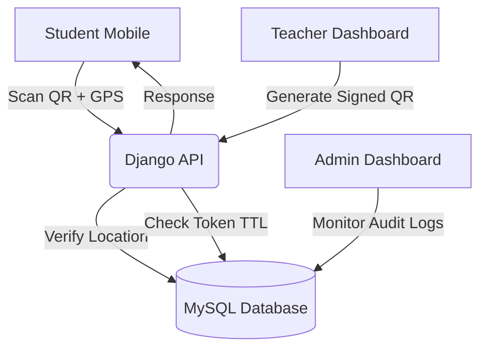

# 🎯 Attendance Management System (AMS)


[](https://www.djangoproject.com/)
[](https://www.mysql.com/)
[](LICENSE)
[](https://github.com/AnilYadav17/Attendance-Management-System)

> **Elevate Institutional Efficiency** With a state-of-the-art geo-fenced QR attendance ecosystem. Secure, instant, and architected for scale.

---

## 🌟 Overview

The **Attendance Management System (AMS)** is a robust, enterprise-grade solution designed to eliminate attendance fraud and automate academic tracking. Leveraging **Geo-fencing validation** and **Dynamic HMAC-signed QR codes**, it ensures that students are physically present in the classroom during the scan.

---

## 🚀 Core Features

### 🔐 Multi-Role Architecture
- **Admin Orchestration**: High-level control over Users (Faculty/Students), Batches, and Global subjects. Access to critical **Audit Logs** for security forensic analysis.
- **Faculty Command Center**: Real-time session generation with customizable geo-fencing radius and dynamic QR rotating engine.
- **Student Portal**: Seamless mobile-first scanning experience with automated location verification and attendance history tracking.

### 🛡️ Next-Gen Security
- **Geo-Fencing Validation**: Pinpoint GPS accuracy checks to prevent off-site scanning.
- **Dynamic QR Engine**: Self-rotating QR codes prevent session reuse and unauthorized photo-sharing.
- **HMAC Signing**: All QR data is cryptographically signed with a limited TTL (Time-To-Live).
- **Audit Logging**: Comprehensive traceability for every sensitive action performed within the system.

---

## 🛠️ Technology Stack

| Layer | Technology |
|---|---|
| **Backend** | Python 3.x, Django 4.2+ |
| **Database** | MySQL / MariaDB (Optimized with `utf8mb4`) |
| **Frontend** | HTML5 (Semantic), Vanilla CSS (Custom Design System), JS (ES6+) |
| **QR Engine** | `qrcodejs` (JS Client-side Generation) |
| **Analytics** | Chart.js for real-time visualization |

---

## 🏗️ System Architecture



---

## ⚙️ Installation & Setup

### 1. Environment Preparation
```bash
# Clone And Enter
git clone https://github.com/AnilYadav17/Attendance-Management-System.git
cd Attendance-Management-System

# Initialize Virtual Env
python -m venv venv

# Activate Virtual Env
# For Windows:
venv\Scripts\activate

# For Linux/macOS:
source venv/bin/activate

# Install Dependencies
pip install -r requirements.txt
```

### 2. Database Configuration
1. Create a MySQL database named `attendance_db1`.
2. Configure your credentials in `.env`:
```env
DB_USER=your_user
DB_PASSWORD=your_password
DB_HOST=localhost
DB_PORT=3306
SECRET_KEY=generate_a_secure_key
```

### 3. Deployment
```bash
# Apply migrations
python manage.py migrate

# Initialize Superuser
python manage.py createsuperuser

# Launch Platform
python manage.py runserver
```

---

## 📂 Project Structure

```text
├── attendance_management_system/   # Core Application Logic
│   ├── migrations/                 # Database Schema Evolutions
│   ├── static/                     # Premium CSS & JS Assets
│   ├── templates/                  # Modular HTML Architecture
│   └── settings.py                 # System Configuration
├── media/                          # Generated QR & Branded Assets
├── manage.py                       # CLI Gateway
└── requirements.txt                # Dependency Manifest
```

---

## 🤝 Contributing

Contributions are what make the open source community such an amazing place to learn, inspire, and create. Any contributions you make are **greatly appreciated**.

1. Fork the Project
2. Create Your Feature Branch (`git checkout -b feature/AmazingFeature`)
3. Commit Your Changes (`git commit -m 'Add some AmazingFeature'`)
4. Push to the Branch (`git push origin feature/AmazingFeature`)
5. Open a Pull Request

---

## 📜 License

Distributed Under The MIT License. See `LICENSE` for more information.

**Developed with ❤️ by [Anil Yadav](https://github.com/AnilYadav17)**
